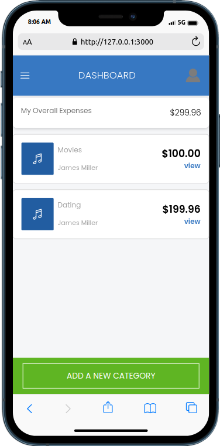

# 📗 Table of Contents

- [📖 About the Project](#about-project)
  - [🛠 Built With](#built-with)
    - [Tech Stack](#tech-stack)
    - [Key Features](#key-features)
    - [Screenshots](#screenshots)
- [💻 Getting Started](#getting-started)
  - [Setup](#setup)
  - [Prerequisites](#prerequisites)
  - [Install](#install)
  - [Usage](#usage)
  - [Run tests](#run-tests)
  - [Deployment](#triangular_flag_on_post-deployment)
- [👥 Authors](#authors)
- [🔭 Future Features](#future-features)
- [🤝 Contributing](#contributing)
- [⭐️ Show your support](#support)
- [🙏 Acknowledgements](#acknowledgements)
- [📝 License](#license)

# 📖 [Budget Flow] <a name="about-project"></a>

A simple budget application made with tailwind and rails framework.

## 🛠 Built With <a name="built-with"></a>

### Tech Stack <a name="tech-stack"></a>

<details>
  <summary>Client</summary>
  <ul>
    <li>HTML(erb), CSS, Tailwind</li>
  </ul>
</details>

<details>
  <summary>Server</summary>
  <ul>
    <li>Ruby</li>
  </ul>
</details>

<details>
<summary>Database</summary>
  <ul>
    <li>Postgress</li>
  </ul>
</details>

### Key Features <a name="key-features"></a>

- **Register and login**
- **Category List (Home page) **
- **Budget List (Expenses page)**
- **Add Expense (Expenses page)**
- **Add Category (Categories page) **

<p align="right">(<a href="#readme-top">back to top</a>)</p>

### Screenshots <a name="screenshots"></a>

<div align="center">
  
  
  
  
  
  
  
</div>

<p align="right">(<a href="#readme-top">back to top</a>)</p>

## 💻 Getting Started <a name="getting-started"></a>

To get a local copy up and running, follow these steps.

### Prerequisites

In order to run this project you need: any web-browser.

### Setup

Clone this [repository](https://github.com/Stephen-Adom/budget_flow.git) to your desired folder.

### Install

This project does not require installation.

### Usage

**To run the project follow the following instruction:-**

- Clone this [repository](https://github.com/Stephen-Adom/budget_flow.git) in your local machine with correct branch.
- Run the following commands:-
- **rails db: migrate**
- **rails s**

### Run tests

To run tests, run the following command:

```sh
  ./bin/rails test:all*
```

### Deployment

You can deploy this project using: **Not available**.

<p align="right">(<a href="#readme-top">back to top</a>)</p>

## 👤 Author <a name="authors"></a>

👤 **Stephen Addae**

- GitHub: [@Stephen-Adom](https://github.com/Stephen-Adom)
- LinkedIn [Stephen Addae](https://www.linkedin.com/in/stephen-addae/)

## 🔭 Future Features <a name="future-features"></a>

- [ ] **All transactions**
- [ ] **Account Settings**
- [ ] **Expense Analysis**

<p align="right">(<a href="#readme-top">back to top</a>)</p>

## 🤝 Contributing <a name="contributing"></a>

Contributions, issues, and feature requests are welcome!

Feel free to check the [issues page](https://github.com/Stephen-Adom/budget_flow/issues).

<p align="right">(<a href="#readme-top">back to top</a>)</p>

## ⭐️ Show your support <a name="support"></a>

If you like this project give a ⭐️.

<p align="right">(<a href="#readme-top">back to top</a>)</p>

## 🙏 Acknowledgments <a name="acknowledgements"></a>

I would like to thank Microverse for this project and [Gregoire Vella on Behance](https://www.behance.net/gregoirevella) for the original design idea.

<p align="right">(<a href="#readme-top">back to top</a>)</p>

## 📝 License <a name="license"></a>

This project is [MIT](./LICENSE) licensed.

<p align="right">(<a href="#readme-top">back to top</a>)</p>
